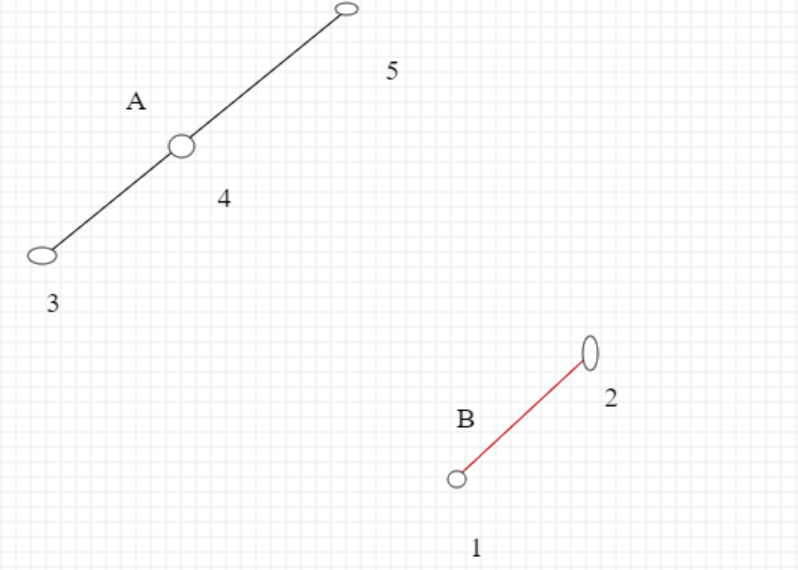

# 专题一、旋转数组
这种题，大概就是二分查找
仔细想想，有顺序的数组就很容易二分了，达到平均O(logn)的时间复杂度

我们用二分的模板，我先扔出来，这是从labuladong大佬学来的，我自己写了套js版，我平时就背这个
```js
左侧查找
function left_bound(nums = [], target) {
    let left = 0,
        right = nums.length - 1;
    while (left <= right) {
        const mid = left + parseInt((right - left) / 2);
        if (nums[mid] === target) {
            right = mid - 1;
        } else if (nums[mid] < target) {
            left = mid + 1;
        } else if (nums[mid] > target) {
            right = mid - 1;
        }
    }
    if (left >= nums.length || nums[left] !== target) {
        return -1;
    }
    return left;
}

右侧查找
function right_bound(nums= [], target) {
    let right = nums.length - 1,
        left = 0;
    while (left <= right) {
        const mid = left + parseInt((right - left) / 2);
        if (nums[mid] === target) {
            left = mid + 1;
        } else if (nums[mid] > target) {
            right = mid - 1;
        } else if (nums[mid] < target) {
            left = mid + 1;
        }
    }
    if (right < 0 || nums[right] !== target) {
        return -1;
    }
    return right;
}
```

遇见二分，我觉得就是以这些模板，进行修改、适配吧

循序渐进四道题：

1. [33.搜索旋转排序数组](https://leetcode.cn/problems/search-in-rotated-sorted-array/)
这个题，我一开始想到二分，但是搞不清楚具体细节，最后看了答案，现在自己分析下

因为有序数组，无论旋转多少次，一定是两段单调上升的序列，所以用好这个性质很重要。
看这张图

最后是AB两端上升区间，我们发现最右侧的2很重要，如果值大于2必然在A，小于2必然在右侧，用好它很关键。

于是我们每次用中点mid(mid = (left + right) / 2)的值比较最右侧的right，判断我们现在在A还是B。
同时，我们可以圈定一个区间，如果在左侧，就是0到mid。如果target在其中，只要让右侧向左收缩，否则左侧向右收缩。
如果在右侧同理，知识区间换位mid到nums.length-1

代码如下：
```js
/**
 * @param {number[]} nums
 * @param {number} target
 * @return {number}
 */
var search = function(nums, target) {
    let left = 0,
        right = nums.length - 1
    const n = nums.length - 1
    while (left <= right) {
        const mid = Math.floor((left + right) / 2)
        if (nums[mid] === target) {
            return mid
        }
        if (nums[mid] > nums[n]) {
            if (nums[0] <= target && target < nums[mid]) {
                right = mid - 1
            } else {
                left = mid + 1
            }
        } else {
            if (nums[mid] < target && target <= nums[n]) {
                left = mid +1
            } else {
                right = mid - 1
            }
        }
    }
    return -1
};
```

再看153
1. [153.搜索旋转排序数组](https://leetcode.cn/problems/find-minimum-in-rotated-sorted-array/)
本质是一样的，只是开始找最小值，大体思路不变，还是修改细节。
因为是增区间，最小值一定出现在，两个区间断开的地方，也就是最小值前一个值比它大，或者说只有一个区间（也就是没旋转），那么最小值就是下标为0的值

如果mid在右侧那段，就一直right向左，一定能遇到最小值
如果mid在左侧那段，left就向右，一定能成功

```js
/**
 * @param {number[]} nums
 * @return {number}
 */
var findMin = function(nums) {
    let left = 0,
        right = nums.length - 1
    //先解决了只有一个单调增区间的情况
    if (nums[left] <= nums[right]) return nums[0]

    while (left < right) {
        const mid = Math.floor((left + right) / 2)
        //如果最小就返回
        if (nums[mid] < nums[mid - 1]) return nums[mid]

    
        if (nums[mid] < nums[right]) {
            right = mid - 1
        } else {
            left = mid + 1
        }
    }

    return nums[right]
};
```


81 和 154就不细说了，思路全部一样，只是有重复值。我们一直需要最右侧那个值，如果它和最左侧值一样会很讨厌。所以我们先去掉右侧重复的值。代码如下

81
```js
/**
 * @param {number[]} nums
 * @param {number} target
 * @return {boolean}
 */
var search = function(nums, target) {
    let len = nums.length - 1
    while (len > 0 && nums[len] === nums[0]) {
        len--
    }

    let left = 0,
        right = len

    while (left <= right) {
        const mid = Math.floor((left + right) / 2)

        if (nums[mid] === target) return true

        if (nums[mid] > nums[len]) {
            if (nums[0] <= target && target < nums[mid]) {
                right = mid - 1
            } else {
                left = mid + 1
            }
        } else if (nums[mid] <= nums[len]) {
            if (nums[mid] < target && target <= nums[len]) {
                left = mid + 1
            } else {
                right = mid - 1
            }
        } 
    }


    return false
};
```

154
```js
/**
 * @param {number[]} nums
 * @return {number}
 */
var findMin = function(nums) {
    let len = nums.length - 1

    while (len > 0 && nums[len] === nums[0]) {
        len--
    }

    if (nums[len] >= nums[0]) return nums[0]
    
    let left = 0,
        right = len


    while (left < right) {
        const mid = Math.floor((left + right) / 2)
        if (nums[mid] < nums[mid - 1]) {
            return nums[mid]
        }   

        if (nums[mid] > nums[len]) {
            left = mid + 1
        } else if (nums[mid] < nums[len]) {
            right = mid - 1
        } else if (nums[mid] === nums[len]) {
            right = mid - 1
        }
    }
    return nums[right]
};
```